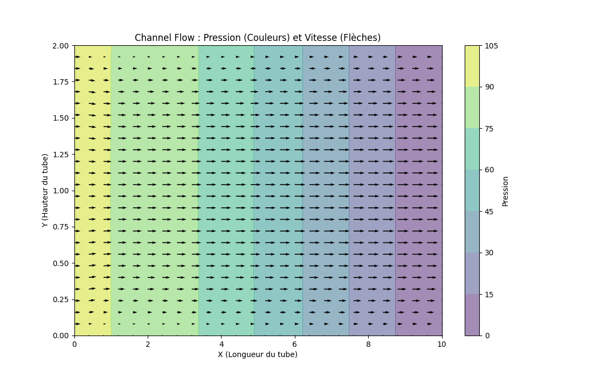

# Python CFD Solver: De la convection linéaire en 1D à Navier-Stokes en 2D

Ce projet est une implémentation complète d'un solveur de mécanique des fluides (CFD), basée sur le module pédagogique 12 Steps to Navier-Stokes du Pr. Lorena Barba (https://github.com/barbagroup/CFDPython)

L'objectif est de démontrer la progression numérique depuis une simple convection linéaire 1D jusqu'à la résolution complète des équations de Navier-Stokes en 2D pour simuler un écoulement en cavité entraînée (Lid-Driven Cavity Flow) ou en canal (Channel Flow).

## Résultats Finaux

### I - Cavité Entraînée

Simulation d'un fluide visqueux dans une boîte dont le couvercle se déplace à vitesse constante.

Vecteurs : Champ de vitesse (Tourbillon central).

Couleurs : Champ de pression (Gradients).

### II- Ecoulement dans un canal

Simulation d'un écoulement de Poiseuille entre deux parois fixes (Channel Flow).

Vecteurs : Développement du profil de vitesse parabolique.

Validation : Comparaison directe avec la solution analytique théorique.

### Aspects physiques \& mathématiques

Le cœur du solveur résout les équations de Navier-Stokes pour un fluide incompressible en 2D :

$$\\frac{\\partial u}{\\partial t} + u \\frac{\\partial u}{\\partial x} + v \\frac{\\partial u}{\\partial y} = -\\frac{1}{\\rho}\\frac{\\partial p}{\\partial x} + \\nu \\left(\\frac{\\partial^2 u}{\\partial x^2} + \\frac{\\partial^2 u}{\\partial y^2} \\right)$$

$$\\frac{\\partial^2 p}{\\partial x^2} + \\frac{\\partial^2 p}{\\partial y^2} = b \\quad (\\text{Equation de Poisson pour la Pression})$$

## Structure du Projet

L'architecture sépare la logique de calcul (src) de la visualisation (notebooks).

.

├── src/               # Moteur de calcul (Librairie)

│   ├── solver\_1d.py   # Algorithmes 1D (Convection, Burgers...)

│   └── solver\_2d.py   # Algorithmes 2D (Laplace, Poisson, Navier-Stokes)

│

├── notebooks/         # Scripts d'exécution et de visualisation

│   ├── 01\_...         # Progression étape par étape

│   └── 10\_cavity\_flow.py # Le script principal

│

├── results/           # Résultats et images générées

└── requirements.txt   # Dépendances

## Installation et Usage

### Cloner le dépôt :

git clone \[https://github.com/GalenoS/CFD\_Navier\_Stokes\_12Steps.git](https://github.com/GalenoS/CFD\_Navier\_Stokes\_12Steps.git)

cd CFD\_Navier\_Stokes\_12Steps

### Installer les dépendances :

pip install -r requirements.txt

### Lancer la simulation finale :

cd notebooks

python 10\_cavity\_flow.py

## Stack Technique

NumPy : Manipulation matricielle et opérations vectorisées (Slicing).

Matplotlib : Visualisation 2D (Quiver, Contourf) et 3D (Surface plots).

Méthode Numérique : Différences finies (Finite Difference Method) explicites.

***Projet réalisé dans le cadre d'un portfolio d'ingénierie aérospatiale***

